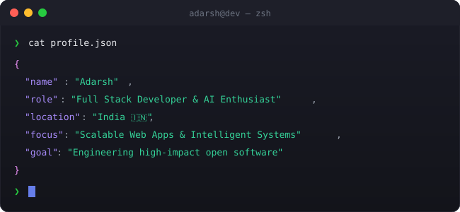
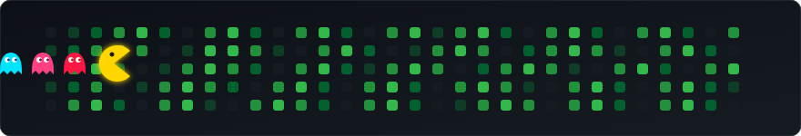

<!-- 
╔══════════════════════════════════════════════════════════════════════════════╗
║                                                                              ║
║      █████╗ ██████╗  █████╗ ██████╗ ███████╗██╗  ██╗                        ║
║     ██╔══██╗██╔══██╗██╔══██╗██╔══██╗██╔════╝██║  ██║                        ║
║     ███████║██║  ██║███████║██████╔╝███████╗███████║                        ║
║     ██╔══██║██║  ██║██╔══██║██╔══██╗╚════██║██╔══██║                        ║
║     ██║  ██║██████╔╝██║  ██║██║  ██║███████║██║  ██║                        ║
║     ╚═╝  ╚═╝╚═════╝ ╚═╝  ╚═╝╚═╝  ╚═╝╚══════╝╚═╝  ╚═╝                        ║
║                                                                              ║
║          🚀 FULL STACK DEVELOPER • AI ENTHUSIAST • PROBLEM SOLVER 🚀         ║
║                                                                              ║
╚══════════════════════════════════════════════════════════════════════════════╝
-->

<div align="center">
  
  <!-- ═══════════════════════════════════════════════════════════════════════════ -->
  <!-- 🎯 ANIMATED HEADER                                                          -->
  <!-- ═══════════════════════════════════════════════════════════════════════════ -->
  
  
  
  <br/>
  
  <!-- ═══════════════════════════════════════════════════════════════════════════ -->
  <!-- 📊 PROFILE BADGES                                                           -->
  <!-- ═══════════════════════════════════════════════════════════════════════════ -->
  
  <a href="https://github.com/AdarshVasth">
    
  </a>
  &nbsp;
  <a href="https://github.com/AdarshVasth?tab=repositories">
    
  </a>
  &nbsp;
  <a href="https://github.com/AdarshVasth?tab=followers">
    
  </a>
  &nbsp;
  <a href="https://github.com/AdarshVasth">
    
  </a>
  
</div>

<br/>

<!-- ═══════════════════════════════════════════════════════════════════════════ -->
<!-- 💻 TERMINAL INTRO SECTION                                                   -->
<!-- ═══════════════════════════════════════════════════════════════════════════ -->

<div align="center">
  
</div>

<br/>


<br/>

<!-- ═══════════════════════════════════════════════════════════════════════════ -->
<!-- 👤 ABOUT ME SECTION                                                         -->
<!-- ═══════════════════════════════════════════════════════════════════════════ -->


<br/><br/>

<table>
<tr>
<td width="55%" valign="top">

### 🎯 What I Do

```yaml
name: Adarsh
located_in: India 🇮🇳
current_status: Developer & Computer Science Student

areas_of_expertise:
  - 🌐 Full-Stack Web Development
  - 🤖 AI & Intelligent Applications
  - 💡 Data Structures & Algorithms
  - ⚡ High Performance APIs & DevOps
  - 🎨 Modern UI/UX Engineering

currently_building:
  - Next-gen Web & AI Applications
  - Interactive developer tools & dashboards
  - Scalable backend architectures

life_philosophy: "Code is poetry, execution is art."
```

</td>
<td width="45%" valign="top">

### 🚀 Current Focus

- 🔬 **Building & Deploying** modern web applications
- 🧠 **Exploring** AI models, LLMs & intelligent agents
- 💻 **Solving** algorithmic challenges & DSA on LeetCode
- 🌟 **Contributing** to open-source projects
- 🚀 **Mastering** cloud platforms, DevOps & system design

<br/>

### 💡 Quick Facts

- 🎯 Strong problem-solving & competitive mindset
- 🔥 Passionate about clean code and modern design
- 🌱 Always experimenting with new frameworks & tech
- ☕ Fueled by curiosity, logic & continuous learning

</td>
</tr>
</table>

<br/>


<br/>

<!-- ═══════════════════════════════════════════════════════════════════════════ -->
<!-- 🏆 ACHIEVEMENTS SECTION                                                     -->
<!-- ═══════════════════════════════════════════════════════════════════════════ -->


<br/><br/>

<div align="center">
  
  <!-- GitHub Trophies -->
  <a href="https://github.com/ryo-ma/github-profile-trophy">
    
  </a>
  
</div>

<br/>


<br/>

<!-- ═══════════════════════════════════════════════════════════════════════════ -->
<!-- 📊 GITHUB ANALYTICS                                                         -->
<!-- ═══════════════════════════════════════════════════════════════════════════ -->


<br/><br/>

<div align="center">
  
  <!-- GitHub Stats + Custom Streak in ONE ROW -->
  <a href="https://github.com/AdarshVasth">
    
  </a>
  &nbsp;
  <a href="https://github.com/AdarshVasth">
    
  </a>
  
  <br/><br/>
  
  <!-- 📊 REAL-TIME LANGUAGE USAGE -->
  <a href="https://github.com/AdarshVasth">
    
  </a>
  
  <br/><br/>
  
  <!-- Additional Profile Details / Activity Summary -->
  <a href="https://github.com/AdarshVasth">
    
  </a>
  
</div>

<br/>


<br/>

<!-- ═══════════════════════════════════════════════════════════════════════════ -->
<!-- 🎮 CONTRIBUTION SHOWCASE                                                    -->
<!-- ═══════════════════════════════════════════════════════════════════════════ -->


<br/><br/>

<div align="center">
  
  <!-- Pac-Man Contribution Graph -->
  <picture>
    <source media="(prefers-color-scheme: dark)" srcset="./assets/pacman-contribution-graph-dark.svg"/>
    <source media="(prefers-color-scheme: light)" srcset="./assets/pacman-contribution-graph.svg"/>
    
  </picture>
  
  <br/>
  
  <sub>👾 Watch Pac-Man devour contributions!</sub>
  
</div>

<br/>


<br/>

<!-- ═══════════════════════════════════════════════════════════════════════════ -->
<!-- ⚡ TECH STACK                                                               -->
<!-- ═══════════════════════════════════════════════════════════════════════════ -->


<br/><br/>

<div align="center">

<!-- 💻 LANGUAGES -->
<h4>💻 Languages</h4>
<p>
  <a href="https://developer.mozilla.org/en-US/docs/Web/JavaScript" target="_blank"></a>
  <a href="https://www.typescriptlang.org/" target="_blank"></a>
  <a href="https://www.python.org/" target="_blank"></a>
  <a href="https://isocpp.org/" target="_blank"></a>
  <a href="https://en.wikipedia.org/wiki/C_(programming_language)" target="_blank"></a>
  <a href="https://developer.mozilla.org/en-US/docs/Web/HTML" target="_blank"></a>
  <a href="https://developer.mozilla.org/en-US/docs/Web/CSS" target="_blank"></a>
  <a href="https://www.gnu.org/software/bash/" target="_blank"></a>
</p>

<!-- 🌐 FRONTEND & FULLSTACK -->
<h4>🌐 Frontend &amp; Frameworks</h4>
<p>
  <a href="https://reactjs.org/" target="_blank"></a>
  <a href="https://nextjs.org/" target="_blank"></a>
  <a href="https://nodejs.org/" target="_blank"></a>
  <a href="https://expressjs.com/" target="_blank"></a>
  <a href="https://tailwindcss.com/" target="_blank"></a>
  <a href="https://getbootstrap.com/" target="_blank"></a>
</p>

<!-- 🗄️ DATABASES & CLOUD -->
<h4>🗄️ Databases &amp; Cloud</h4>
<p>
  <a href="https://www.mongodb.com/" target="_blank"></a>
  <a href="https://www.postgresql.org/" target="_blank"></a>
  <a href="https://www.mysql.com/" target="_blank"></a>
  <a href="https://firebase.google.com/" target="_blank"></a>
  <a href="https://vercel.com/" target="_blank"></a>
</p>

<!-- 🛠️ TOOLS & PLATFORMS -->
<h4>🛠️ Tools &amp; Environment</h4>
<p>
  <a href="https://git-scm.com/" target="_blank"></a>
  <a href="https://github.com/" target="_blank"></a>
  <a href="https://code.visualstudio.com/" target="_blank"></a>
  <a href="https://www.linux.org/" target="_blank"></a>
  <a href="https://www.postman.com/" target="_blank"></a>
  <a href="https://www.figma.com/" target="_blank"></a>
</p>

</div>

<br/>


<br/>

<!-- ═══════════════════════════════════════════════════════════════════════════ -->
<!-- ⚡ CURRENTLY WORKING ON                                                     -->
<!-- ═══════════════════════════════════════════════════════════════════════════ -->

<div align="center">
  
### ⚡ Currently Building &amp; Learning

<br/>

<a href="https://github.com/AdarshVasth">
  
</a>
&nbsp;
<a href="https://github.com/AdarshVasth">
  
</a>
&nbsp;
<a href="https://github.com/AdarshVasth">
  
</a>

</div>

<br/>


<br/>

<!-- ═══════════════════════════════════════════════════════════════════════════ -->
<!-- 🌐 CONNECT WITH ME                                                          -->
<!-- ═══════════════════════════════════════════════════════════════════════════ -->


<br/><br/>

<div align="center">
  
<a href="https://github.com/AdarshVasth" target="_blank">
  
</a>
&nbsp;
<a href="https://linkedin.com/in/adarshvasth" target="_blank">
  
</a>
&nbsp;
<a href="https://leetcode.com/u/AdarshVasth" target="_blank">
  
</a>
&nbsp;
<a href="mailto:your_email@example.com">
  
</a>

</div>

<br/>


<br/>

<!-- ═══════════════════════════════════════════════════════════════════════════ -->
<!-- 💬 RANDOM DEV QUOTE                                                         -->
<!-- ═══════════════════════════════════════════════════════════════════════════ -->

<div align="center">
  
### 💬 Random Dev Quote

<br/>

<a href="https://github.com/AdarshVasth">
  
</a>

</div>

<br/>

<!-- ═══════════════════════════════════════════════════════════════════════════ -->
<!-- 🌟 FOOTER                                                                   -->
<!-- ═══════════════════════════════════════════════════════════════════════════ -->

<div align="center">
  
  
  
  <br/>
  
  
  
</div>

<!-- ═══════════════════════════════════════════════════════════════════════════ -->
<!-- 🏁 END OF README                                                            -->
<!-- ═══════════════════════════════════════════════════════════════════════════ -->
